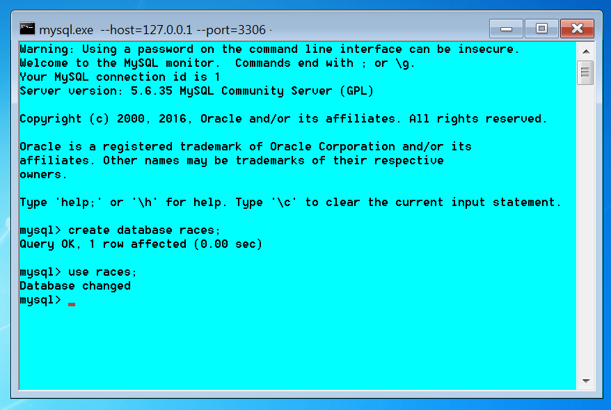

# Intro to SQL and relational databases

## 1. Designing an extremely simple database

For these first examples, we are going to use MySQL. If you are in Windows, you 
don't even need to install this database manager, as you can use an environment 
such as the "**Uniform Server**", which will allow you to "install" (just 
uncompress, actually) a portable system including MySQL, Apache, PHP and a few 
other tools. This system will be active only when you want it to, so it will 
not make your computer slower.


Our first command would be to create a new database, in which we will store
data about car races. We will call it "races", so we should use the command:

```sql
create database races;
```

Next we must tell MySQL that we want the use the database we have just created:

```sql
use races;
```

If you have downloaded and installed the Uniform Server (remember, it is not
a real installation, just uncompressing in a specific folder), you can start
MySQL server and click on the button which read "MySQL console", so these
steps would look like this:



We will create only one block of information at this point. Each block of 
information will be called a "**table**". Our first table will hold data about 
drivers. For each driver we will store several data (each of these data will be 
called a "**field**"): their name and the name the work in. This is not a good 
design (yet?), as we will explain later, but it will be enough for us to start. 
Also, we need something to allow us distinguish one driver from another, even 
if both have the same name and surname, so we will include and additional 
field, an "id" (identifier) for each driver. This field which can identify
one driver from another is what we are going to call a "**primary key**".

There are several ways to represent a table. A very common and compact one
is in a rectangle, in which the first row is the name of the table:


A less compact and more "classic" way is detailing the fields ("attributes") 
inside ellipses, and underlining the primary key (this format is more common 
for the starting "conceptual" design, while the previous format is more usual 
for the "real" implementation of the design using tables):


(Note: the first diagram was created using [draw.io](https://www.draw.io/)
and the second one with [ERDplus](https://erdplus.com/#/standalone). Both are
online tools which can be used freely).

We must also specify which kind of information will be stored in each of these 
fields. The most usual is text, up to a certain amount of letters. This data 
type is called VARCHAR (varying characters), and the limit of letters is 
indicated using parenthesis.

Considering all of this, our command to create the new table would be:

```sql
create table drivers (
  id varchar(10) primary key,
  name varchar(40),
  teamName varchar(30)
);

```

To enter data, we must use "INSERT INTO", and specify the values between quotation
marks, as in this example:

```sql
insert into drivers values ('svet', 'Sebastian Vettel', 'Ferrari');
```

If we do no want to enter all the data for a driver, or we want to enter the 
data in a different order that what we used when we defined the table, we
must specify also the names of the fields, this way:

```sql
insert into drivers (id, name, teamName) 
values ('lham', 'Lewis Hamilton', 'Mercedes');
```

Finally, we should check that the data we entered are actually there. The 
command to obtain information from a table is "SELECT ... FROM". If we just want
to obtain all the information, we would use an asterisk, like in this example:

```sql
select * from drivers;
```

Which should display the following:

```txt
+------+------------------+----------+
| id   | name             | teamName |
+------+------------------+----------+
| lham | Lewis Hamilton   | Mercedes |
| svet | Sebastian Vettel | Ferrari  |
+------+------------------+----------+
```


#### Suggested exercises:

- SQL.01.01. Create a database named "computers". It will contain only a table, also named "computers", with three fields: id, brand and model.

- SQL.01.02. Enter two example computers: the "Sinclair" (brand) "Zx Spectrum 16K" (model), with id "spec16k", and the "Amstrad" (brand) "CPC 464" (model), with id "cpc464".

- SQL.01.03. Show all the data, so that you can check they are correctly stored.

