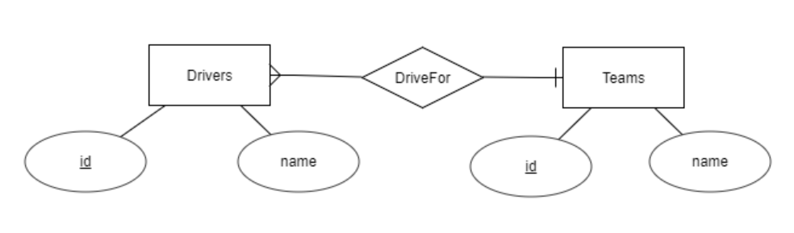

# Intro to SQL and relational databases

## 3. One-to-many relationships

Our first design included the name of the team as part of the data for a driver.
Such approach has several problems, for example:

* Our design could take less space. For example, if we write down "RBR" instead of a name such as "Red Bull Racing", we are saving a few bytes in each record, and those bytes may get to mean a difference when have millions of records.

* Repeating long data might lead to inconsistencies. For example, if we type "Red Bull Rcing" in one of the records, such record might not appear in later searches, because it is not correctly written.

* Conceptually, a team may have several drivers, and each driver belongs (in a certain date) to only one team.

Because of this, a more correct way to design this database (but not the best way...yet) would be using two entities (drivers, teams) and a relationship between them (a driver "drives for" a team). This is a "one-to-many" (or "1:M") relationship: a driver belongs to one team, and a team can have many drivers. The corresponding Entity-Relationship diagram might be like this:



There are several variations to this notation. For example, there are author who prefer to darken the side of the "many":


Also, we can express the "minimum cardinality" in each side of the relationship. 
For example, we might detail that each team in our database must contain at least one driver, and that each driver can belong to 0 or 1 team (so we might be able to have information about driver who are not currently on any team). The modifications for the first diagram would be as follows:


The way to create the tables for a 1:M relationship, enter data and display them, might be:

```sql
-- Let's start a new database
create database races2;
use races2;

-- Creating the tables
create table teams (
  id varchar(2) primary key,
  name varchar(30)
); 

create table drivers (
  id varchar(10) primary key,
  name varchar(40),
  teamId varchar(2),
  foreign key (teamId) references teams(id)
); 

-- Adding data
insert into teams values ('f', 'Ferrari');
insert into teams values ('m', 'Mercedes');

insert into drivers values ('svet', 'Sebastian Vettel', 'f');
insert into drivers values ('lham', 'Lewis Hamilton', 'm');

-- And displaying data
select * from drivers, teams where drivers.teamId = teams.id; 
```

The result for the last command would be:

```txt
+------+------------------+--------+----+----------+
| id   | name             | teamId | id | name     |
+------+------------------+--------+----+----------+
| svet | Sebastian Vettel | f      | f  | Ferrari  |
| lham | Lewis Hamilton   | m      | m  | Mercedes |
+------+------------------+--------+----+----------+
```

We can display only several fields and use "aliases" for a more legible name, this way:

```sql
select drivers.name as driverName, teams.name as teamName
from drivers, teams 
where drivers.teamId = teams.id
order by driverName; 
```

Which would display:

```txt
+------------------+----------+
| driverName       | teamName |
+------------------+----------+
| Lewis Hamilton   | Mercedes |
| Sebastian Vettel | Ferrari  |
+------------------+----------+
```


#### Suggested exercises:

- SQL.03.01. Create a database named "computers2", in which the "computerBrands" will be moved to a new table. Create the corresponding tables and enter a couple of data in them.

- SQL.03.02. Display the brand and model for the computers whose brand starts with a S. 

- SQL.03.03. Display the brand and model for the computers launched in 1982 or later. 

- SQL.03.04. Display the brand and model of our computers, sorted by brand and then by model.

