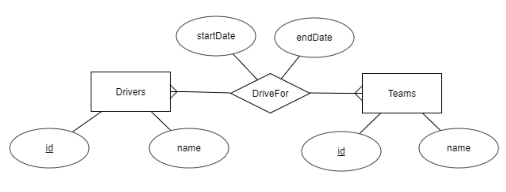

# Intro to SQL and relational databases

## 4. Many-to-many relationships

In our previous re-design, we supposed that each drivers was in one team and
each team might have several drivers, so we used a one-to-many relationship.

But that assumption is too simplistic. In the real world, a driver can spend
each season (or even just a part of it) in a different team. Therefor, we have
a many-to-many relationship, which would be represented this way:


or this way:


and, when converting to tables, this relationship would become a new table,
with the primary keys of the other tables as attributes, and both acting as
a compound primary key:

```sql
create table drivers (
  id varchar(10) primary key,
  name varchar(40)
);

create table teams (
  id varchar(2) primary key,
  name varchar(30)
);  

create table driveFor (
  driverId varchar(10),
  teamId varchar(2),
  primary key (driverId, teamId)
); 
```
Conceptually, even tough maybe not supported in some simple database managers,
"driverId" is also a "foreign key", which references to the "id" in "drivers"
(which means that we cannot add a record in "driveFor" with a "driverId" which
does no exist in drivers). The situation is the same for "teamId", so a mire
detailed definition would be:

```sql
create table driveFor (
  driverId varchar(10),
  teamId varchar(2),
  primary key (driverId, teamId),
  foreign key (teamId) references teams(id),
  foreign key (driverId) references drivers(id)
); 
```

But we can make it even a bit more real: a driver can return to a team in a
later date, so we might need two additional attributes for the relationship
(yes, relationships can have attributes, too): the start date and the end date:

```sql
create table driveFor (
  driverId varchar(10),
  teamId varchar(2),
  startDate date,
  endDate date,
  primary key (driverId, teamId, startDate),
  foreign key (teamId) references teams(id),
  foreign key (driverId) references drivers(id)
); 
```

The corresponding diagram would look like this:




And a complete example might be:

```sql
-- Let's start a new database
create database races3;
use races3;

-- Creating the tables

create table drivers (
  id varchar(10) primary key,
  name varchar(40)
);

create table teams (
  id varchar(2) primary key,
  name varchar(30)
);  

create table driveFor (
  driverId varchar(10),
  teamId varchar(2),
  startDate date,
  endDate date,
  primary key (driverId, teamId, startDate),
  foreign key (teamId) references teams(id),
  foreign key (driverId) references drivers(id)
); 


-- Adding data
insert into teams values ('f', 'Ferrari');
insert into teams values ('m', 'Mercedes');

insert into drivers values ('svet', 'Sebastian Vettel');
insert into drivers values ('lham', 'Lewis Hamilton');

insert into driveFor values ('svet', 'f', '2015-10-01', null);
insert into driveFor values ('lham', 'M', '2016-10-01', null);


-- And displaying data
select drivers.name as driverName, teams.name as teamName
from drivers, teams, driveFor
where teams.id = driveFor.teamId
and drivers.id = driveFor.driverId
order by driverName;  
```

And the result for the last command would be:

```txt
+------------------+----------+
| driverName       | teamName |
+------------------+----------+
| Lewis Hamilton   | Mercedes |
| Sebastian Vettel | Ferrari  |
+------------------+----------+
```


#### Suggested exercises:

- SQL.04.01. In your database "computers2", add a many-to-any relationship between a new table "games" and the computers (a game can be breated for several different computers, and each computer can have several games designed for it).

- SQL.04.02. Add data of several games for the existing platforms. 

- SQL.04.03. Display the name of the games we have for the ZX Spectrum. 

- SQL.04.04. Add the game Fruity Frank for the Amstrad CPC. Check it by displaying all the games whose name starts with "F" and which are for computers which contain "CPC" in ther model.

- SQL.04.05. Display the amount of games we have for the QL.

