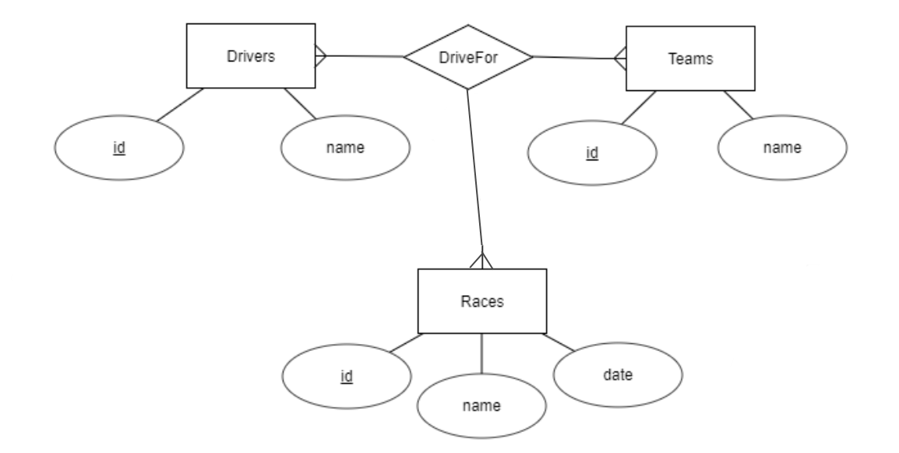
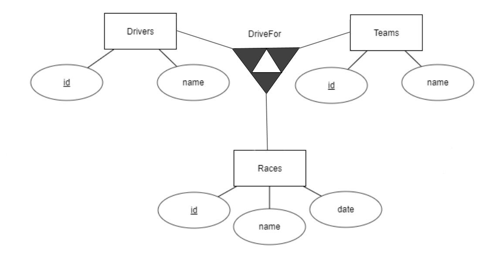
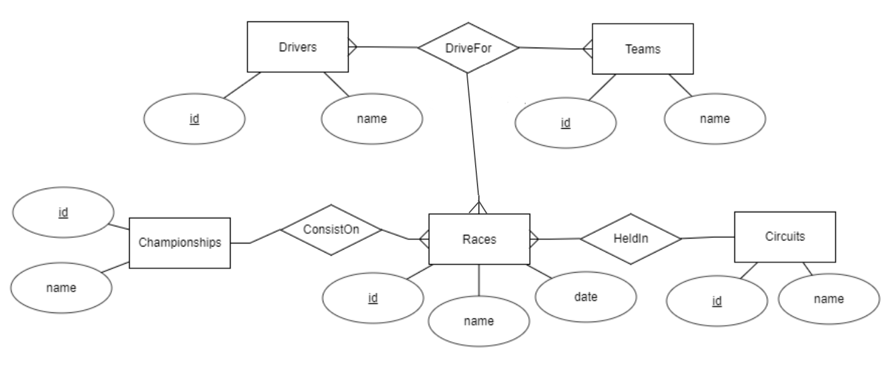

# Intro to SQL and relational databases

## 5. Ternary relationships

The many-to-many relationship reflects better the relation ship between 
drivers and teams. But sometimes, these relations may involve three or
more entities. For example, a driver might take part in a race for a team,
but switch teams for a later race. Therefore it is "more real" to think as
"this driver has been in this race for this team", and the three entities
would be linked, like this:



or this way:



When converting to tables, this ternary relationship would also become a new 
table. In the case of M:M:M (many-to-many-to-many), the primary keys of 
the three other tables would be its attributes, and all of them would behave
as a compound primary key and as foreign keys:

```sql
create table drivers (
  id varchar(10) primary key,
  name varchar(40)
);

create table teams (
  id varchar(2) primary key,
  name varchar(30)
);  

create table races (
  id varchar(8) primary key,
  name varchar(50)
);  

create table driveFor (
  driverId varchar(10),
  teamId varchar(2),
  raceId varchar(8),
  primary key (driverId, teamId, raceId),
  foreign key (teamId) references teams(id),
  foreign key (driverId) references drivers(id),
  foreign key (raceId) references races(id)
); 
```

Do you want a bigger challenge? Try to implement, add data and obtain info
for the following information system:




#### Suggested exercises:

- SQL.05.01. Implement the whole database shown in the previous diagram.

- SQL.05.02. Add several example races. For example, "Sebastian Vettel" run for "Ferrari" named "2017 FORMULA 1 ROLEX BRITISH GRAND PRIX", wich took place in the "Silverstone Circuit", as part of the "Formula 1 2017 season".

- SQL.05.03. Display the races in which Vettel has participated. 

- SQL.05.04. Display the races in which Vettel has participated for the Team Ferrari. 

- SQL.05.05. Display the Silverstone races in which Vettel has participated.

- SQL.05.06. Display the amount of races held in Silverstone. 

- SQL.05.07. Display the driver, team, race name and circuit name for all the races in the "Formula 1 2017 season".

